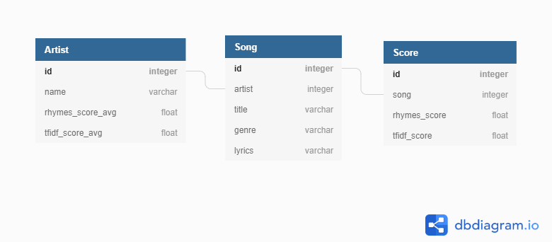

# Lyrics Analysis

A tool for analyzing linguistic properties of
song lyrics, accompanied by a web app that
can provide the results in an accessible manner.

## Installation guide

Download the source code.

The `lyrics_analysis` module can be accessed by
typing `import lyircs_analysis` in a python file.

To run the web app, navigate to the `./la_site/`
directory in your command line and run
`python manage.py runserver`. You can then access
the app from your browser. The database is not
a part of this source code, you will have to
provide your own corpus.

## `lyrics-analysis` module

The module contains the following submodules:

  - `evaluation`, the main submodule. It provides
  methods for evaluating song lyrics and outputting
  a single number for the given metric. It contains
  the following methods:
    - `rhymes`: Calculates the proportion of
    rhyming lines in the lyrics.
    - `tf_idf`: Calculates the tf-idf metric,
    which is a way of measuring the 'uniqueness'
    of words.
    
    The remaining methods will not be maintained
    in the future.
  - `modifications`, a submodule that is primarily
  used for testing purposes. It contains methods
  that alter text.
    - `replace_last_words_on_line`: Replaces last
    words on lines at a given rate by words
    from a provided list of words.
    - `remove_last_word_on_line`: Removes last
    words on lines at a given rate.
    - `remove_words_on_line`: Removes words (not
    only at the end of line) at a given rate.
  - `sampler`, contains the method `sample_n_songs_from_generator`
  which returns a generator that yields randomly
  selected songs from the source.
  - `tests`, provides the method
  `calculate_metric_quality` which is able to
  compute the proportion of correctly scored
  sets of songs if it is given the approximate
  order in which the sets should be scored.
  - `helpers`, a submodule containing helper
  funcions used throughout the code. They may
  not be maintained in the future.
  
## Database schema

The database schema is as follows:

## Further documentation

Further documentation can be found here:
https://drive.google.com/file/d/1jnYymj03vDdY2Asb6pgoqR1p8RvDpzgv/view?usp=sharing

